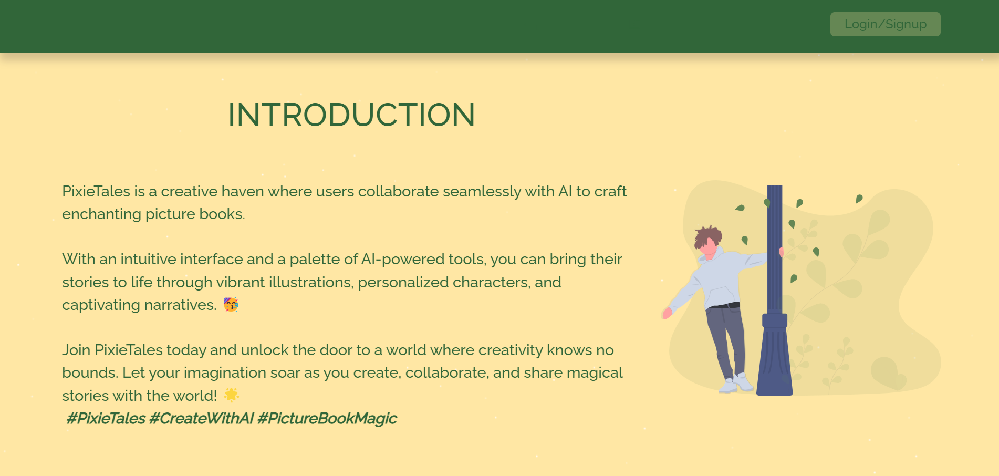

# Web app: Picture book project
## Description
This project is a web application that allows users to create picture books or e-books by enter prompts to Chat-GPT.
## Frontend Installation
1. Frontend Installation:
```bash
npm install
```
2. Add your OpenAI API Key to 
- MyStory\api\get-text.js
- MyStory\api\get-image.js
- Story\api\get-text.js
- Story\api\get-image.js

3. In the frontend directory, run: 
```bash
npm start
```

Runs the app in the development mode.\
Open [http://localhost:3000](http://localhost:3000) to view it in the browser.
The page will reload if you make edits.

## Backend Installation
For backend installation, please click [here](https://github.com/wzyeeen/web-app_picture-book/blob/main/backend/README.md).




## Reference：
1. [Storybird](https://storybird.com)
2. [Storybird AI](https://storybird.ai/)


